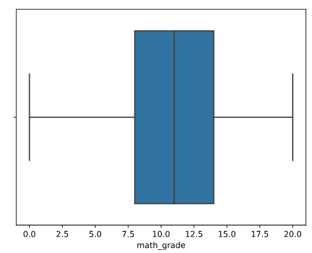
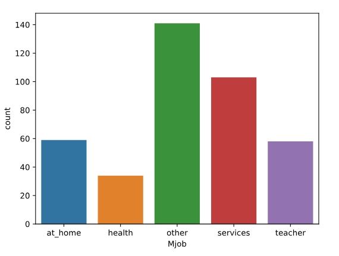
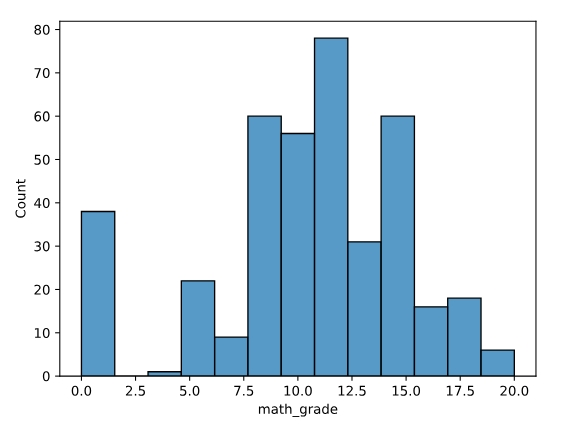
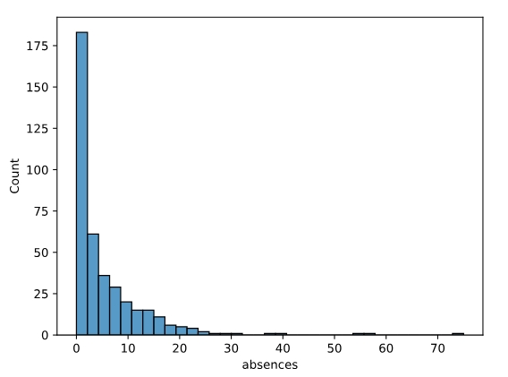

# Exploring Student Data Analysis

### Project Overview
---

This project aims to provide insightful analysis of student performance, parental occupations, and attendance patterns within a local school district. By utilizing collected data, we aim to address key questions such as how students are performing in their math classes, what students’ parents do for work, and how often students are absent from school.

   


### Data Sources

Student.csv: The primary dataset utilized for the analysis is the "Student.csv" file, which contains student information, including address, absences, mother's job, father's job, and math grade.

### Tools

-Dataset - [Student.csv](students.csv)

-Python - programing insights implemeting and utalizing python libraries such as pandas, numpy, matplotlib, and seaborn

### Analysis process

In the data cleaning process phase, we performed tasks such as:
Loading necessary libraries and importing the data from a CSV file
Printing the first few rows of the data for an initial inspection
Printing summary statistics for all columns to understand the data distribution
Calculating key statistics for the ‘math_grade’ column:
Mean
Median
Mode
Range
Standard deviation
Mean Absolute Deviation (MAD)
Creating visualizations to explore the data:
Histogram of math grades
Box plot of math grades
Analyzing categorical data:
Calculating the number and proportion of students with mothers in each job category
Creating bar and pie charts for the ‘Mjob’ column
Additional visualizations:
Pie chart of students’ addresses
Histogram of absences
Bar chart of fathers’ job categories

### Exploratory Data Analysis

##### Main Question
-Which county of Washington state contains the most EV vehicle registrations
##### Bonus Questions
-Which EV vehicles contain the highest driving range

-What other states are registered in the Washington DOL

### Data Analysis

```python
# Load libraries
import pandas as pd
import numpy as np
import matplotlib.pyplot as plt
import seaborn as sns

# Import data
students = pd.read_csv('students.csv')

# Print first few rows of data
print(students.head())
# Print summary statistics for all columns
print(students.describe(include='all'))
# Calculate mean
print(students.math_grade.mean())
# Calculate median
print(students.math_grade.median())
# Calculate mode
print(students.math_grade.mode()[0])
# Calculate range
print(students.math_grade.max() - students.math_grade.min())
# Calculate standard deviation
print(students.math_grade.std())
# Calculate MAD
print(students.math_grade.mad())
# Create a histogram of math grades

sns.histplot(x='math_grade',data=students)
plt.show()
plt.clf()

# Create a box plot of math grades

sns.boxplot(x='math_grade',data=students)
plt.show()
plt.clf()

# Calculate number of students with mothers in each job category
print(students.Mjob.value_counts())
# Calculate proportion of students with mothers in each job category
print(students.Mjob.value_counts(normalize=True))
# Create bar chart of Mjob

sns.countplot(x='Mjob',data=students)
plt.show()
plt.clf()

# Create pie chart of Mjob

students.Mjob.value_counts().plot.pie()
plt.show()
plt.clf()

#Extra
students.address.value_counts().plot.pie()
plt.show()
plt.clf()

sns.histplot(x='absences',data=students)
plt.show()
plt.clf()

sns.countplot(x='Fjob',data=students)
plt.show()
plt.clf()
```

### Results

My findings are summarized as follows:
1. King County had the highest registration count under the Washington DOL.
2. The vehicles in the top-performing EV range include the Chevy Bolt, Hyundai Kona, and Tesla Model S.
3. The other top states registered under the Washington DOL include California, Virginia, and Maryland.

### Recommendations

Based on the results formulated from the analysis:

The counties of King, Snohomish, and Pierce have the highest chance of electric vehicle-related engagement.
Focusing on those areas will increase the likelihood of engagement, as EVs are exponentially more prevalent in these regions.

### Limitations
Unfortunately, some rows have missing values that could not be accounted for in certain calculations. Though the number of NULL values wasn't large, there is still data missing from our overall findings. 

### References

Dua, D. and Graff, C. (2019). UCI Machine Learning Repository [http://archive.ics.uci.edu/ml]. 

Irvine, CA: University of California, School of Information and Computer Science. [http://archive.ics.uci.edu/ml/datasets/Student+Performance]

Paulo Cortez, University of Minho, Guimarães, Portugal, [http://www3.dsi.uminho.pt/pcortez]

